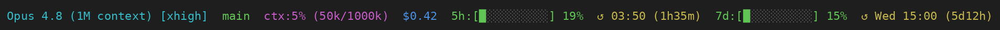

# claude-statusline

A statusline script for [Claude Code](https://claude.ai/code) that displays model, git branch, context usage, session cost, and rolling rate limit progress bars.

## What it shows



```
Sonnet 4.6 [plan]  main  ctx:19% (38k/200k)  $0.88  5h:[█░░░░░░░░░] 13%  ↺ 14:32 (3h26m)  7d:[██░░░░░░░░] 20%  ↺ Sat 22:14 (3d8h)
```

- **Model** — display name of the active model, with effort/mode shown in brackets when known (e.g. `[xhigh]`, `[plan]`, `[fast]`). Effort comes from the live session, falling back to `effortLevel` (or a `plan`/`fast` model suffix) in `~/.claude/settings.json`
- **Git branch** — current branch of the workspace
- **ctx%** — context window usage percentage and token count (`used/total`)
- **$X.XX** — session cost so far
- **5h bar** — 5-hour rolling rate limit usage with reset time and countdown
- **7d bar** — 7-day rolling rate limit usage with reset time, day-of-week, and countdown
- **⬆ update** — shown in yellow when a newer GitHub release exists, with the command to update (checked once per day)

Colors go green → yellow → red as usage crosses 50% and 80%.

## Requirements

- `jq` — `sudo apt-get install jq` / `brew install jq`
- `git`
- `awk` (standard on all platforms)
- `curl` (standard on all platforms, used for update checks)

## Installation

**One-liner:**

```bash
bash <(curl -fsSL https://raw.githubusercontent.com/HarunTeper/claude-statusline/main/install.sh)
```

**Manual:**

1. Copy `statusline-command.sh` to `~/.claude/statusline-command.sh`
2. Add to `~/.claude/settings.json`:

```json
{
  "statusLine": {
    "type": "command",
    "command": "bash ~/.claude/statusline-command.sh"
  }
}
```

That's it — Claude Code picks it up immediately.

## Updating

When the status line shows `⬆ <version> — git pull && bash install.sh`, a newer release is available. From your local clone:

```bash
git pull && bash install.sh
```

This re-copies the latest `statusline-command.sh` to `~/.claude/`. Claude Code picks up the new version on the next render.
